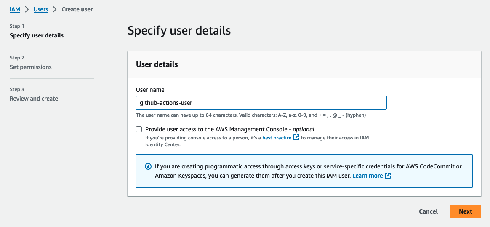
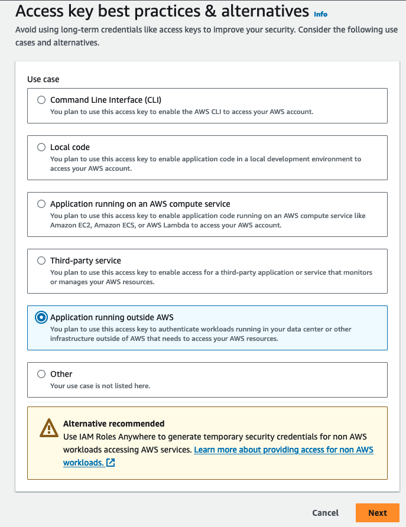
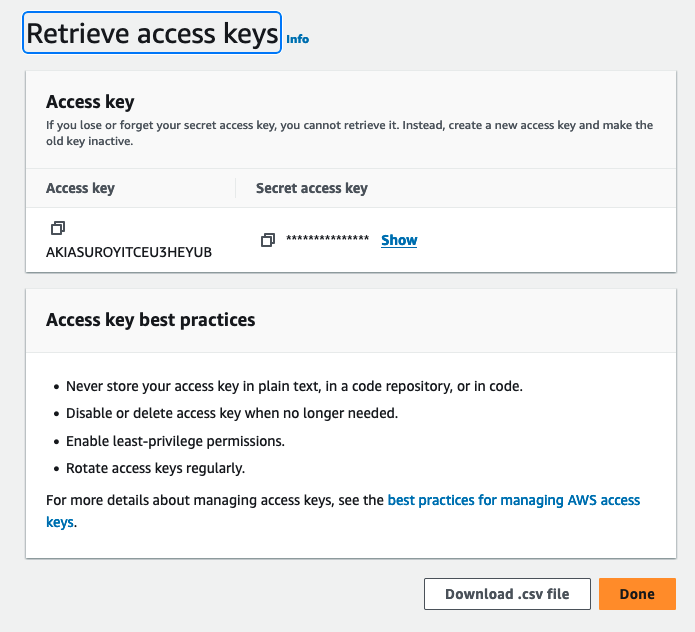
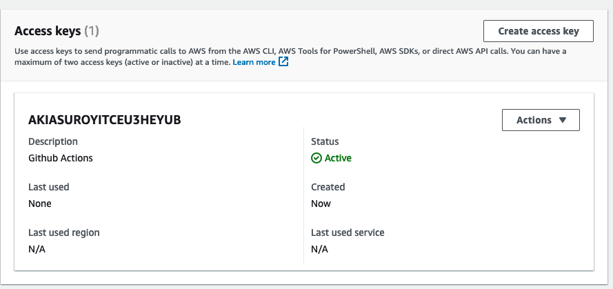
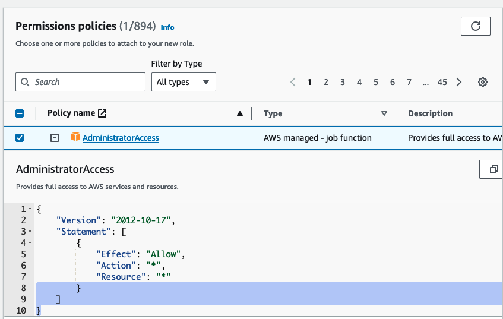
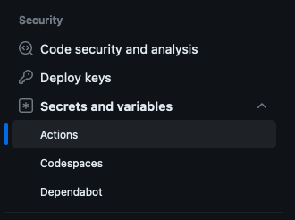
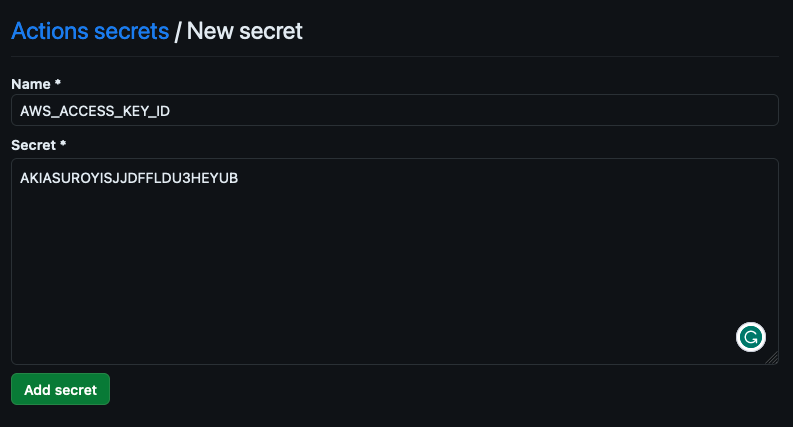

# Terraform Pipeline Example
Educational example to explain how to create Infrastructure as Code pipelines with Github Actions.

The goal is to explain, in a simple way, the manual step-by-step so that the core concepts can be reused by any bootstrap process at scale.


# Setup Permissions - No Automation

## Create and Pragmatic User on AWS Console. 

1. For this example, a user named `github-actions-user` will be created. 



2. Now, create Access Key for pragmatic access outside of AWS.



3. Save or Download your Access and Secret keys. This values will be used latter for pipeline configuration.  





## Create an IAM Role with assume-role locked for `github-actions-user`. 

For this example, will be created a role named `github-actions-role`. 

4. Let's create an AssumeRole policy and we'll specify the ARN of the user we created for the pipeline.

```json
{
	"Version": "2012-10-17",
	"Statement": [
		{
			"Sid": "Statement1",
			"Effect": "Allow",
			"Principal": {
				"AWS": "arn:aws:iam::<account-id>:user/github-actions-user"
			},
			"Action": "sts:AssumeRole"
		}
	]
}
```

5. To simplify the example, let's create the role with full permission. For production use, it's highly recommended to use granular permissions only for the resources that your pipelines will provision. For educational purposes, we'll use `AdministratorAccess`.




```json
{
    "Version": "2012-10-17",
    "Statement": [
        {
            "Effect": "Allow",
            "Action": "*",
            "Resource": "*"
        }
    ]
}
```


## Setup your Actions Secrets 

Now, go to your Terraform infrastructure repository and click on `Settings > Secrets and Variables > Actions > New Repository Secret`



Create 2 Secrets called `AWS_ACCESS_KEY_ID` and `AWS_SECRET_ACCESS_KEY` with respect values created for `github-actions-user`.





## Explaination - Github ACtions

Now we might be able to authenticate in the pipeline steps like this:

```yaml

    runs-on: ubuntu-latest
    steps:
      - name: Checkout
        uses: actions/checkout@v2

      - name: Configure AWS Credentials
        uses: aws-actions/configure-aws-credentials@v1
        with:
          aws-access-key-id: ${{ secrets.AWS_ACCESS_KEY_ID }}
          aws-secret-access-key: ${{ secrets.AWS_SECRET_ACCESS_KEY }}
          aws-region: us-east-1 
          role-to-assume: arn:aws:iam::181560427716:role/github-actions-role
          role-session-name: GitHubActions

```